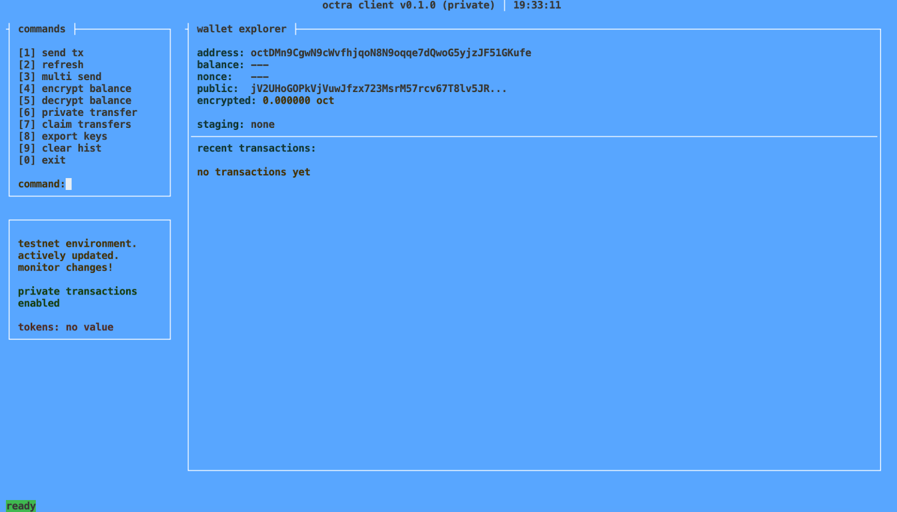
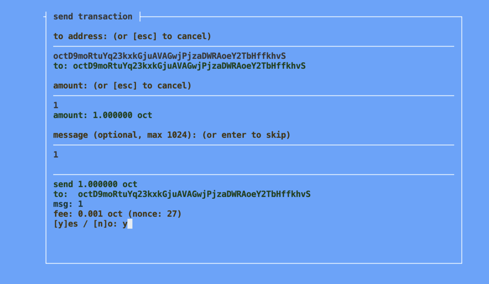
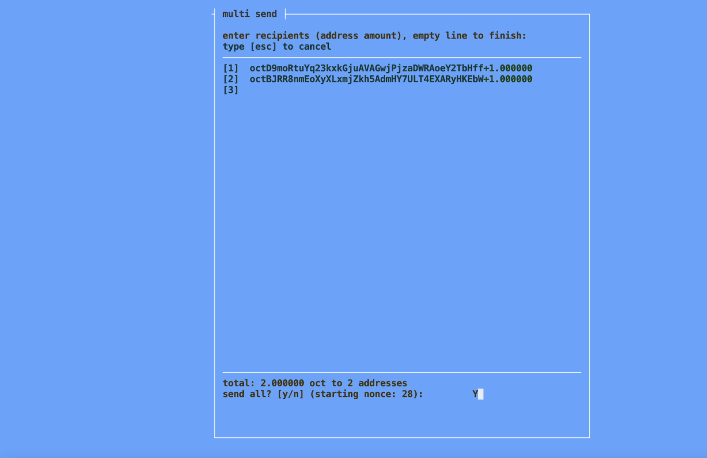
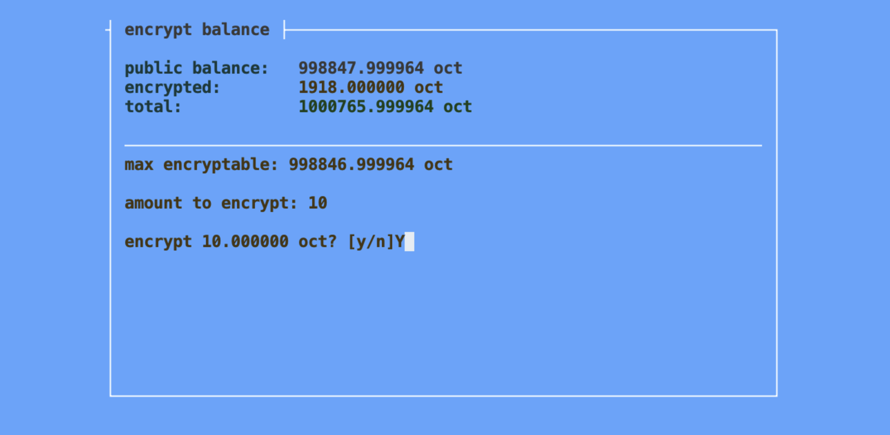
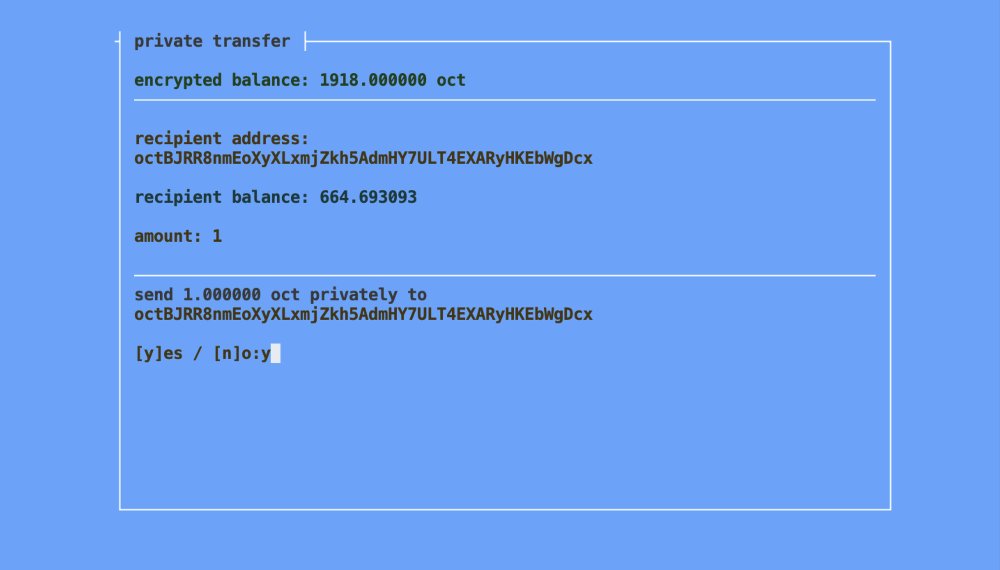
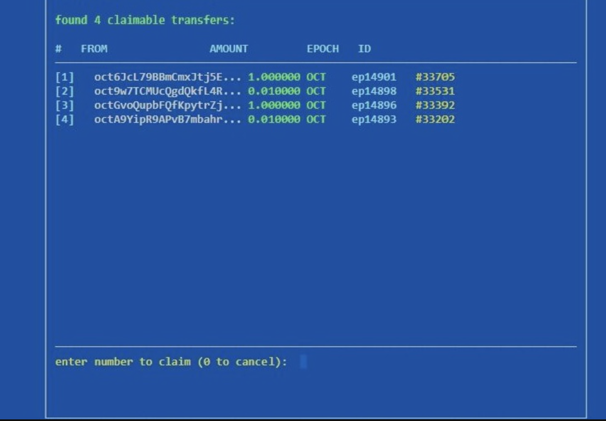

# Octra Testnet İstemcisi VPS Kurulum Rehberi

Bu rehber, Octra Testnet istemcisini bir Sanal Özel Sunucu (VPS) üzerine kurmak, yapılandırmak ve **Screen** kullanarak SSH oturumundan bağımsız olarak arka planda çalıştırmak için gerekli adımları özetler.

[](#)

## ⚠️ ÖNEMLİ UYARI
Bu kurulum, Octra tarafından sağlanan komutlara dayanır ve testnet katılımı amaçlıdır. Cüzdan özel anahtarlarınızı (priv) her zaman güvenli bir yerde saklayın.

---

## 1. Ön Koşullar (VPS)

* **İşletim Sistemi:** Yeni bir Linux tabanlı VPS (Ubuntu 22.04+ veya Debian önerilir).
* **Erişim:** VPS'inize SSH ile erişim.
* **Gereksinimler:** Python 3, `git`, `pip` ve **`screen`** yüklü olmalıdır.

Eğer `screen` yüklü değilse, aşağıdaki komutla kurabilirsiniz (Debian/Ubuntu için):
```bash
sudo apt update && sudo apt install screen -y
sudo apt install unzip -y

```

## 2. Cüzdan Oluşturma ve Test Token'ı Alma
A. Cüzdan Oluşturma        

Gerekli ise bun paket yöneticisini kurun
```bash
curl -fsSL https://bun.sh/install | bash
```

PATH Değişkenini Güncelleyin:

```bash
export PATH="$HOME/.bun/bin:$PATH"
```

Cüzdan oluşturucu işlemini çalıştırın
```bash
curl -fsSL https://octra.org/wallet-generator.sh | bash
```
Kaydetmeniz Gerekenler: Ekranda çıkan `priv` (özel anahtar) ve `addr` (adres) bilgilerini **KESİNLİKLE** güvenli bir yere kaydedin.


## 3. İstemci Kurulumu ve Yapılandırması


**İstemci Deposunu Klonlayın:**

```bash

git clone [https://github.com/octra-labs/octra_pre_client.git](https://github.com/octra-labs/octra_pre_client.git)
cd octra_pre_client
```

**Sanal Ortam Kurulumu:**

```bash

python3 -m venv venv
source venv/bin/activate
```

**Bağımlılıkları Yükleyin:**

```bash

pip install -r requirements.txt
```

**Cüzdan Yapılandırmasını Hazırlayın:**

```bash

cp wallet.json.example wallet.json
```

**`wallet.json` Dosyasını Düzenleyin:**

`nano wallet.json` komutunu kullanarak dosyayı açın ve daha önce aldığımız kendi cüzdan bilgilerinizle değiştirin:

**JSON içeriği böyle görünecek:**    

"priv": "buraya aldığınız keyi yazacaksınız"     
"addr": "buraya da sana verilen cüzdan adresini yazacaksınız"      

```bash
{
  "priv": "B64-private-key-buraya",
  "addr": "octxxxxxxxxxxxxxxxxxxxxxxxxxxxxxxxxxxxxxxxxx",
  "rpc": "https://octra.network"
}
```
**(Nano'da: Kaydetmek için Ctrl + O sonra dosyayı kaydetmek için Enter'a basın ve çıkmak için Ctrl + X)**

## 4. İstemciyi Screen Kullanarak Çalıştırma

İstemcinin SSH oturumu kapansa bile çalışmaya devam etmesi için screen kullanılır. Sunucunuzda etkin olduğundan emin olun (source venv/bin/activate).

**Yeni bir Screen oturumu başlatın:**

```bash

screen -S octra-client
```

**İstemciyi çalıştırın:**
Screen oturumunun içindeyken (yeni terminal penceresi açılacak):

```bash
./run.sh
```

---

## 5. İstemci Kullanımı (Menü İşlemleri)

Screen içinde istemci çalıştırıldığında ( `./run.sh ile`), aşağıdaki menü seçenekleriyle etkileşime girebilirsiniz:

[](#)

**5.1. Normal İşlem Gönderme (Send Transaction)**

* 1 yazın ve Enter'a basın.

* Alıcı adresini girin ve Enter'a basın.

* Token miktarını girin ve Enter'a basın.

* (Opsiyonel) Mesaj girin ve Enter'a basın.

* Onaylamak için Y yazın ve Enter'a basın.

[](#)

**5.2. Toplu Gönderme (Multi Send)**   

* 3 yazın ve Enter'a basın.

* Her satır için: adres > boşluk > miktar formatında girip Enter'a basın.

* Tüm alıcıları girdikten sonra, boş bir satırda Enter'a basın.

* Onaylamak için Y yazın ve Enter'a basın.

[](#)

**5.3. Bakiyeyi Şifreleme (Encrypt Balance)**    

* 4 yazın ve Enter'a basın.

* Miktarı girin ve Enter'a basın.

* Onaylamak için Y yazın ve Enter'a basın.

[](#)

**5.4. Şifreli İşlem Gönderme (Send Private Transaction)**   

* 6 yazın ve Enter'a basın.

* Alıcı adresini girin ve Enter'a basın.

* Miktarı girin ve Enter'a basın.

* Onaylamak için Y yazın ve Enter'a basın.

[](#)

**5.5. Bakiyeyi Çözme (Decrypt Balance)**    

* 5 yazın ve Enter'a basın.

* Miktarı girin ve Enter'a basın.

* Onaylamak için Y yazın ve Enter'a basın.

[](#)

**5.6. Transferi Talep Etme (Claim Transfer)**    

* 7 yazın ve Enter'a basın.

* Listeden transfer numarasını seçin ve Enter'a basın.

[](#)

---

**Screen oturumundan ayrılın (detach):**

İstemcinin arka planda çalışmaya devam etmesi için, klavyenizde Ctrl + A tuşlarına basın, hemen ardından D tuşuna basın. Bu, sizi ana terminal oturumunuza geri döndürecektir. Artık sunucu bağlantınızı kapatsanız bile arkada çalışmaya devam edecektir. `screen -ls`	ile mevcut screen oturumlarını listeler. `screen -r octra-client`	komutu ile arka planda çalışan octra-client oturumuna geri bağlanır ve screen içine girersiniz.


